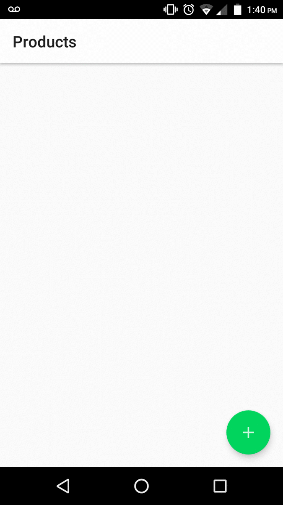

<h1 align="center">
  Strike Product Catalog
</h1>

  <a href="#rocket-projeto">Project</a>&nbsp;&nbsp;&nbsp;|&nbsp;&nbsp;&nbsp;
  <a href="#computer-tecnologias">Techs</a>&nbsp;&nbsp;&nbsp;|&nbsp;&nbsp;&nbsp;
  <a href="#thinking-como-utilizar">How to use</a>&nbsp;&nbsp;&nbsp;|&nbsp;&nbsp;&nbsp;
  <a href="#notebook-notas">Notes</a>&nbsp;&nbsp;&nbsp;|&nbsp;&nbsp;&nbsp;
  <a href="#memo-licença">License</a>

## :rocket: Project

:clipboard: Strike Product Catalog

This project was made for study purposes only, as a proof of concept from recent studies on android app development.

### Preview

    

### Functional Requirements

- [ ] The user can see a list of his products.

- [ ] The user can register a new product.

- [ ] A product must have a name.

- [ ] A product must have a price.

- [ ] A product must have a description.

- [ ] A product must have a category.

- [ ] A product must have many images.

- [ ] A product must have at least an image

## :computer: Techs

- Android Framework
- Android Jetpack
- LiveData
- Java
- Room

## :thinking: How to use

1. Clone the repository to your machine
2. Open the cloned repository in Android Studio
3. Press Run App

### Requirements

- Android Emulator API 19.0 or higher
- Android Studio
- JDK 8 or higher

## :notebook: Notes

## :memo: License

This project is under the GNU license. See more at [LICENSE](LICENSE) file for more information.
